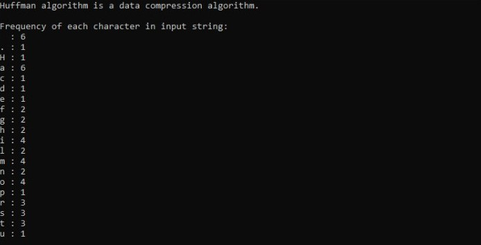
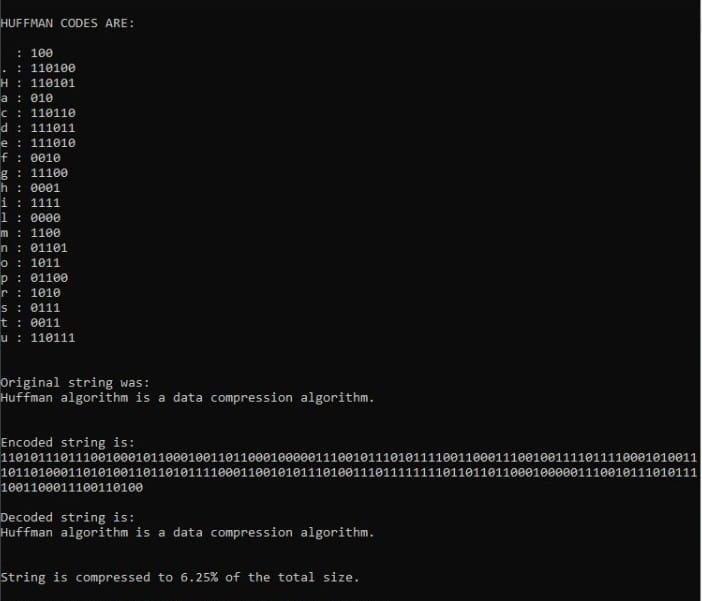

# Huffman-Coding
A C++ compression and decompression program based on Huffman Coding.

## Introduction

This project is to design compression and decompression programs based on Huffman Coding.
The idea of Huffman Coding is to minimize the weighted expected length of the code by means of assigning shorter codes to frequently-used characters and longer codes to seldom-used code.

## Implementation Details

The programs can compress and decompress text consisting of 128 ASCII characters.

### Compression

1. Get the text as input, count and store the frequencies of different characters;
2. Construct Priority Queue and then Huffman Tree;
3. Calculate Huffman Encode Table;
4. Encode the given text using huffman table.

### Decompression

1. Decode the compressed text based on the huffman tree.

***The algorithm serializes the encoded text as a binary/decimal sequence and the corresponding Huffman binary tree in order to be able to decode back the text in the future.***

Here is an example:
Frequency of each character in the given text:

Huffman codes and encoded text in a binary format, decoded text and compression ratio:

As can be seen, string is compressed to about 6% of the original string which was given as input.
